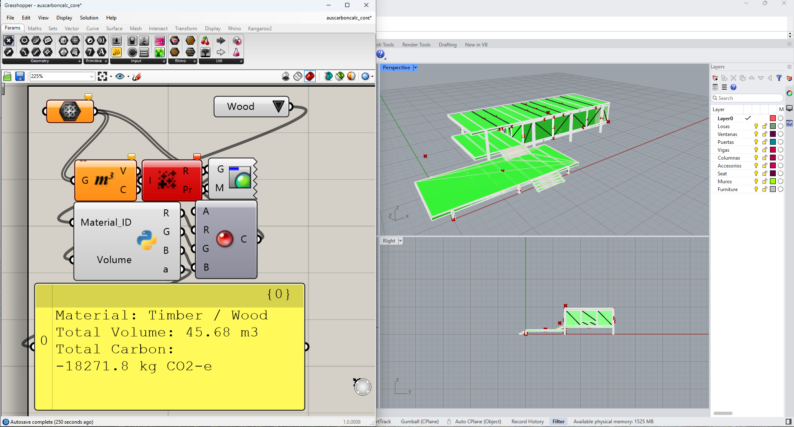
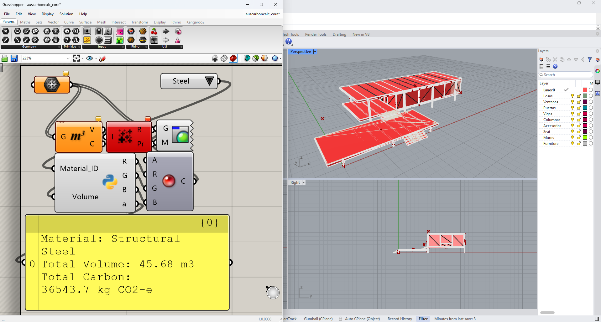

# 🏛️ AusCarbonCalc: Real-Time Upfront Embodied Carbon Auditor

## 📌 Abstract & Research Motivation
As Australia transitions toward a Net-Zero built environment, strict limits on upfront embodied carbon are becoming mandatory. **AusCarbonCalc** is an open-source, ultra-lightweight parametric compliance framework integrated directly within the Rhino 8 / Grasshopper environment. 

Calibrated against the **Australian National Construction Code (NCC 2025)** and localized **AusLCI registries**, this tool provides instantaneous visual feedback on embodied carbon metrics, enabling true generative design iteration at Phase 0 conceptual massing.

---

## 👥 Authors & Core Developers
This framework was developed through a cross-disciplinary academic collaboration bridging advanced computational systems and sustainable environmental design:
*   **Faezeh Akbari Nikjeh** *(Architectural & Sustainability Researcher)*: Formulated the LCA methodology, conducted NCC compliance research, established the absolute carbon thresholds, and led the empirical validation against global EC3 benchmarks.
*   **Mohsen JavdanFard** *(Lead Systems Architect & Developer)*: Conceptualized the algorithmic architecture, developed the fail-safe IronPython data pipelines, and constructed the visual programming logic.

---

## 👁️‍🗨️ Real-Time Visual Feedback
The tool translates complex numerical carbon data into intuitive color-coded physical geometry, bridging the gap between data analytics and spatial design.

### ✅ Standard Passed (Within Limit)
When the cumulative carbon is under the 15,000 kg CO2-e threshold, the building dynamically renders **Green**.
*(See `compliant_green.png` for detailed view)*

### ❌ Standard Exceeded (Over Limit)
As the geometry scales up or carbon-heavy materials are selected, breaching the budget instantly renders the building **Red**.
*(See `noncompliant_red.png` for detailed view)*

---

## ⚙️ Mathematical Core & Logic
By utilizing a robust IronPython core, the tool calculates total structural footprints with execution latencies of `< 12 ms`. The engine computes upfront embodied carbon ($EC_u$) dynamically:

$$EC_{u}=\Sigma(V_{n}\times\rho_{n}\times CF_{n})$$

**Baseline Configurations:**
*   **Absolute Carbon Budget (Threshold):** `15,000.0 kg CO2-e`
*   **Standard Concrete CF:** `320.0 kg CO2-e/m³`
*   **Structural Steel CF:** `800.0 kg CO2-e/m³`
*   **Timber / CLT CF:** `-400.0 kg CO2-e/m³` (Biogenic Sink)

---

## 🚀 3-Step Super Simple Usage Guide
To maintain absolute transparency for academic peer review, the Grasshopper script is deliberately **un-clustered**, allowing users and reviewers to inspect the exact data flow from Geometry extraction to the Python logic core.

**Step 1: Installation & Setup**
1. Open `src/farnsworth_base.3dm` in Rhino.
2. Launch Grasshopper and open `src/auscarboncalc_core.gh`.
3. The structural geometry is pre-linked to the initial `Mesh` parameter.

**Step 2: Assign Materials**
Use the `Value List` dropdown component to instantly toggle between structural materials (Concrete, Steel, Wood). The total volume and carbon footprint will instantly update in the yellow reporting panel.

**Step 3: Activate Live Telemetry**
> ⚠️ **CRITICAL VISUALIZATION NOTE:** 
> Due to Grasshopper's native rendering pipeline and the un-clustered nature of this transparent script, **you MUST click on and select the primary `Mesh` component** in the Grasshopper canvas to activate the visual telemetry.
> *   Once selected, hide your original Rhino layers and watch the colors update live as you scale your design!

---

## 📂 Repository Structure
*   `/src`: Contains the primary Rhino model (`.3dm`) and Grasshopper definition (`.gh`).
*   `/assets`: Contains high-resolution validation screenshots.
*   `/docs`: Contains the draft manuscript and associated academic documentation.

## 📄 License
This project is licensed under the MIT License - ensuring open-access knowledge sharing for the sustainable architecture community.
